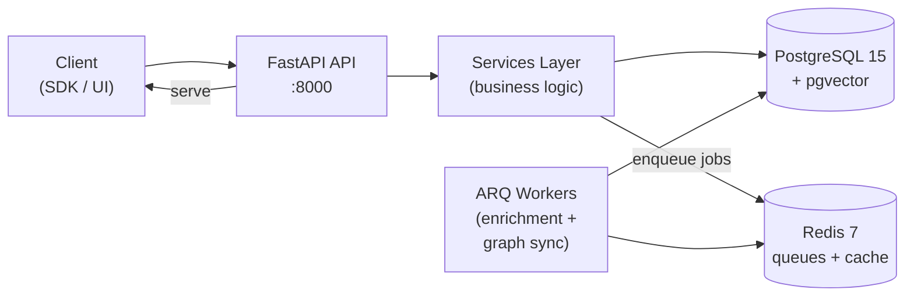

# OpenZync — Open-Source Agent Memory Platform

Persistent, queryable, graph-based memory for AI agents.

<p align="center">
  <a href="./LICENSE"></a>
  
  
</p>

---

## Table of Contents

- [What is OpenZync?](#what-is-openzync)
- [Key Features](#key-features)
- [Architecture](#architecture)
- [Quick Start](#quick-start)
- [API Overview](#api-overview)
- [Memory Pipeline](#memory-pipeline)
- [Configuration](#configuration)
- [Deployment](#deployment)
- [Development](#development)
- [License](#license)

---

## What is OpenZync?

OpenZync is an open-source memory platform for AI agents. It ingests conversational data, enriches it asynchronously into a knowledge graph with entities, facts, and embeddings, and exposes a hybrid search API for LLM context retrieval.

Built for developers who need persistent, queryable agent memory without vendor lock-in. Bring your own LLM (OpenAI, Anthropic, Ollama, Azure, OpenRouter) and your own infrastructure.

---

## Key Features

- **Persistent agent memory** — store and retrieve conversation history with full CRUD
- **Knowledge graph** — automatic entity extraction, relationship mapping, and community detection via Label Propagation
- **Hybrid search** — vector similarity (pgvector) + BM25 full-text + graph traversal, fused via RRF
- **Async enrichment pipeline** — ARQ workers extract entities, facts, embeddings, and classifications from ingested messages
- **Multi-provider LLM** — BYOK support for OpenAI, Anthropic, Ollama, Azure OpenAI, OpenRouter
- **Multi-tenant** — org-scoped data isolation with JWT + API key authentication
- **MCP server** — expose memory tools to any MCP-compatible LLM (Claude Desktop, etc.)
- **Admin dashboard** — Next.js frontend for graph exploration and tenant management
- **Python SDK** — `pip install openzync` (Apache 2.0)

---

## Architecture



The API receives messages and persists them immediately. ARQ background workers asynchronously extract entities, facts, and embeddings, then sync everything to the knowledge graph. Context is retrieved at query time via hybrid search across vector, text, and graph indices.

---

## Quick Start

**Prerequisites:** Python 3.11+, Docker, Ollama (for local LLM).

```bash
# 1. Clone and install
git clone https://github.com/rohnsha0/openzync.git
cd openzync
pip install -e ".[dev]"

# 2. Start infrastructure (PostgreSQL + Redis + Ollama)
cp .env.example .env
docker compose -f infra/docker-compose.backend.yml up -d

# 3. Pull a default LLM model (if using Ollama)
ollama pull llama3.2:3b
ollama pull nomic-embed-text

# 4. Start the API
make dev
# => Uvicorn running on http://localhost:8000

# 5. In a second terminal, start the worker
python -m services.worker.worker

# 6. Sign up and ingest a message
curl -X POST http://localhost:8000/v1/auth/signup \
  -H "Content-Type: application/json" \
  -d '{"email":"demo@example.com","password":"changethis","name":"Demo","organization_name":"DemoOrg"}'
```

See [docs/implementation/13-deployment.md](docs/implementation/13-deployment.md) for production setup.

---

## API Overview

All endpoints are prefixed with `/v1`.

| Endpoint | Description |
|---|---|
| `POST /users/{id}/memory` | Ingest conversation messages (episodes) |
| `GET /users/{id}/context` | Retrieve relevant context for LLM prompts |
| `GET /search?q=...` | Hybrid search across entities, episodes, facts |
| `GET /users/{id}/graph/nodes` | List knowledge graph entities |
| `GET /users/{id}/graph/edges` | List knowledge graph relationships |
| `GET /users/{id}/graph/communities` | List community clusters |
| `POST /auth/signup` | Register a new user + org |
| `POST /auth/login` | Authenticate and receive a JWT |
| `GET /health` | Liveness probe |
| `GET /ready` | Readiness probe (checks DB + Redis) |

For detailed API docs, see [docs/implementation/08-api-gateway.md](docs/implementation/08-api-gateway.md) or run the server and visit `/docs`.

---

## Memory Pipeline

1. **Ingest** — `POST /users/{id}/memory` accepts messages and persists them as episodes in PostgreSQL.
2. **Enrich** — ARQ workers consume episodes asynchronously: extract entities, facts, and classifications; generate embeddings.
3. **Graph sync** — entities and relationships are synced to the graph backend (PostgreSQL-native by default), with temporal edges linking episodes to entities.
4. **Retrieve** — hybrid search combines cosine similarity (pgvector), BM25 full-text, and graph BFS traversal. Results are fused via RRF and assembled into a structured prompt context.
5. **Community detection** — Label Propagation groups related entities into communities. Runs via nightly cron or event-driven after graph sync (controlled by `OZ_AUTO_RUN_COMMUNITY_DETECTION`).

---

## Configuration

Configuration is via environment variables (all prefixed with `OZ_`). Copy `.env.example` to `.env` and edit.

| Variable | Default | Description |
|---|---|---|
| `OZ_DATABASE_URL` | — | PostgreSQL connection string (`postgresql+asyncpg://...`) |
| `OZ_REDIS_URL` | `redis://localhost:6379/0` | Redis connection string |
| `OZ_GRAPH_BACKEND` | `postgres` | Graph backend (`postgres` or `none`) |
| `OZ_LLM_BACKEND` | `ollama` | LLM provider (`ollama`, `openai`, `azure`, `anthropic`, `openrouter`) |
| `OZ_LLM_MODEL` | `llama3.2:3b` | Model name for the LLM provider |
| `OZ_AUTO_RUN_COMMUNITY_DETECTION` | `false` | When `true`, runs community detection after each graph sync (deduped to once/hour/org); when `false`, runs nightly at 02:00 UTC |
| `OZ_LOG_LEVEL` | `INFO` | Minimum log level (`DEBUG`, `INFO`, `WARNING`, `ERROR`) |
| `OZ_SECRET_KEY` | — | Server secret key (min 32 chars) |
| `OZ_CORS_ORIGINS` | `http://localhost:3000` | Comma-separated allowed CORS origins |

Provider-specific keys (`OPENAI_API_KEY`, `ANTHROPIC_API_KEY`, etc.) are read directly without the `OZ_` prefix.

---

## Deployment

- **Docker Compose** — `infra/docker-compose.backend.yml` for the backend stack; `infra/docker-compose.frontend.yml` for the frontend.
- **Kubernetes** — Helm chart at `infra/helm/openzync/`.
- **Requirements** — PostgreSQL 15+ (with pgvector extension), Redis 7+, and an LLM provider (Ollama local or cloud BYOK).
- **Worker** — The ARQ worker runs as a separate process. In Docker Compose, it is the `worker` service.
- **Migrations** — Apply with `make migrate` or `alembic upgrade head`.

See [docs/implementation/13-deployment.md](docs/implementation/13-deployment.md) for environment setup, migration runbook, air-gapped deployment, and disaster recovery.

---

## Development

```bash
make dev              # Start API server (hot-reload on :8000)
python -m services.worker.worker   # Start ARQ background worker
make test             # Run unit tests
make test-all         # Run all tests (unit + integration + security)
make lint             # Ruff check + mypy
make lint-fix         # Auto-fix lint issues
make migrate          # Apply pending Alembic migrations
make migrate-new      # Auto-generate a new migration revision
make docker-up        # Start infra containers (Postgres, Redis, Ollama)
make docker-down      # Stop infra containers
```

The project enforces strict separation of concerns (`routers → services → repositories → models`), async throughout, and typed interfaces. See [docs/implementation/](docs/implementation/) for detailed documentation covering data models, auth, core memory, knowledge graph, NLP pipeline, worker system, SDK, MCP, dashboard, observability, testing, and deployment.

---

## License

The core platform is licensed under the **GNU Affero General Public License v3** — see [LICENSE](./LICENSE).

**Commercial license** available for SaaS deployments that do not wish to release modifications — contact `licensing@thelinkai.com`.

The Python SDK (`oss/sdk-python/`) is licensed under **Apache 2.0**.
