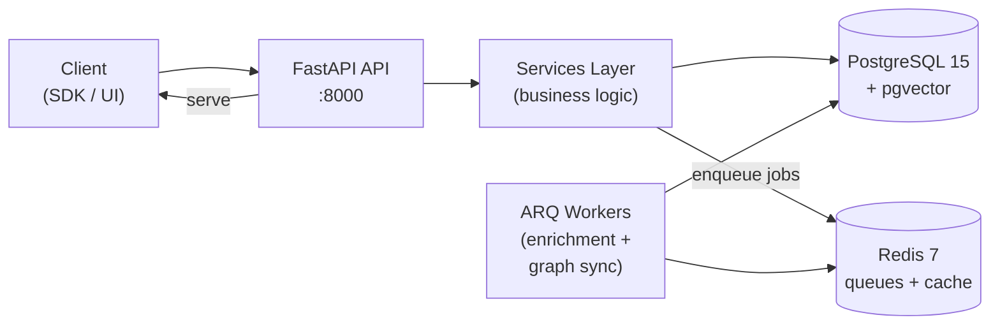

# OpenZync — Open-Source Agent Memory Platform

Persistent, queryable, graph-based memory for AI agents.

<p align="center">
  <a href="./LICENSE"></a>
  
  
</p>

---

## Table of Contents

- [What is OpenZync?](#what-is-openzync)
- [Key Features](#key-features)
- [Architecture](#architecture)
- [Quick Start](#quick-start)
- [API Overview](#api-overview)
- [Memory Pipeline](#memory-pipeline)
- [Configuration](#configuration)
- [Deployment](#deployment)
- [Development](#development)
- [License](#license)

---

## What is OpenZync?

OpenZync is an open-source memory platform for AI agents. It ingests conversational data, enriches it asynchronously into a knowledge graph with entities, facts, and embeddings, and exposes a hybrid search API for LLM context retrieval.

Built for developers who need persistent, queryable agent memory without vendor lock-in. Bring your own LLM (OpenAI, Anthropic, Ollama, Azure, OpenRouter) and your own infrastructure.

---

## Key Features

- **Persistent agent memory** — store and retrieve conversation history with full CRUD
- **Knowledge graph** — automatic entity extraction, relationship mapping, and community detection via Label Propagation
- **Hybrid search** — vector similarity (pgvector) + BM25 full-text + graph traversal, fused via RRF
- **Async enrichment pipeline** — ARQ workers extract entities, facts, embeddings, and classifications from ingested messages
- **Multi-provider LLM** — BYOK support for OpenAI, Anthropic, Ollama, Azure OpenAI, OpenRouter
- **Multi-tenant** — org-scoped data isolation with JWT + API key authentication
- **MCP server** — expose memory tools to any MCP-compatible LLM (Claude Desktop, etc.)
- **Admin dashboard** — Next.js frontend for graph exploration and tenant management
- **Python SDK** — `pip install openzync` (Apache 2.0)

---

## Architecture



The API receives messages and persists them immediately. ARQ background workers asynchronously extract entities, facts, and embeddings, then sync everything to the knowledge graph. Context is retrieved at query time via hybrid search across vector, text, and graph indices.

The system follows an OpenBao-zero-fallback architecture (see [ADR-003](docs/adr/003-openbao-zero-fallback.md) and [ADR-004](docs/adr/004-self-bootstrapping-postgres.md)) — all runtime configuration is auto-generated and stored in OpenBao; only bootstrap secrets (seal key, postgres password, secret key, webhook signing secret) live in `.env`.

---

## Quick Start

**Prerequisites:** Docker, Docker Compose v2, and ~3 GB of free disk space.

```bash
# 1. Clone, set up .env with all required bootstrap secrets
git clone https://github.com/rohnsha0/openzync.git
cd openzync
cp .env.example .env

# Generate and append all four required secrets
echo "BAO_STATIC_SEAL_KEY=$(openssl rand -hex 32)" >> .env
echo "POSTGRES_PASSWORD=$(openssl rand -base64 32)" >> .env
echo "OZ_SECRET_KEY=$(python3 -c 'import secrets; print(secrets.token_urlsafe(48))')" >> .env
echo "OZ_WEBHOOK_SIGNING_SECRET=$(python3 -c 'import secrets; print(secrets.token_urlsafe(32))')" >> .env

# 2. Bring up the entire stack — OpenBao, Postgres, migrations, api, worker
docker compose -f infra/docker-compose.backend.yml up -d

# The first boot takes ~60 seconds:
#   • 0-10s  OpenBao starts
#   • 10-30s OpenBao is initialised + unsealed; system secrets + AppRole credentials written
#   • 30-40s Postgres starts + creates DB and least-privilege roles
#   • 40-50s Alembic migrations run (as openzync_migrator)
#   • 50-55s Database credentials merged into the OpenBao system secret
#   • 55-60s api and worker start (OpenBao Agent sidecar authenticates + renders secrets)

# 3. Verify
curl -s http://localhost:8000/v1/health
curl -s http://localhost:8000/v1/ready

# 4. Sign up (returns a confirmation — tokens issued after email verification)
curl -X POST http://localhost:8000/v1/auth/signup \
  -H "Content-Type: application/json" \
  -d '{"email":"demo@example.com","password":"Changeth1s","organization_name":"DemoOrg"}'

# 5. Check the api container logs for the 6-digit OTP, then verify
curl -X POST http://localhost:8000/v1/auth/verify-email \
  -H "Content-Type: application/json" \
  -d '{"email":"demo@example.com","otp":"<otp-from-logs>"}'

# 6. Use the returned access_token for authenticated calls
export TOKEN="<access-token-from-step-5>"
curl -X POST http://localhost:8000/v1/projects/{project_id}/memory \
  -H "Authorization: Bearer $TOKEN" \
  -H "Content-Type: application/json" \
  -d '{"session_id":"default","messages":[{"role":"user","content":"Hello world"}]}'
```

**That's it.** No `make migrate`, no manual secret copy-paste, no `.env` full of OZ_* keys. The database password is auto-generated and stored in OpenBao. The api and worker fetch their config from OpenBao at startup.

See [the deployment documentation](https://github.com/rohnsha0/openzync/tree/main/infra) for production setup (Docker Compose and Helm charts).

---

## API Overview

All endpoints are prefixed with `/v1`.

| Endpoint | Description |
|---|---|
| `POST /v1/projects/{project_id}/memory` | Ingest conversation messages (episodes) into a project's memory |
| `GET /v1/projects/{project_id}/context` | Retrieve relevant context for LLM prompts, scoped to a project |
| `GET /v1/projects/{project_id}/search?q=...` | Hybrid search across a project's episodes, facts, and entities |
| `GET /v1/projects/{project_id}/graph/nodes` | List knowledge graph entities for a project |
| `GET /v1/projects/{project_id}/graph/edges` | List knowledge graph relationships for a project |
| `GET /v1/projects/{project_id}/graph/communities` | List community clusters for a project |
| `POST /auth/signup` | Register a new user + org |
| `POST /auth/login` | Authenticate and receive a JWT |
| `GET /health` | Liveness probe |
| `GET /ready` | Readiness probe (checks DB + Redis) |

For detailed API docs, run the server and visit `/docs` (Swagger UI) or see the [API Reference](https://github.com/rohnsha0/openzync/tree/main/routers) for endpoint listings.

---

## Memory Pipeline

1. **Ingest** — `POST /v1/projects/{project_id}/memory` accepts messages and persists them as episodes in PostgreSQL.
2. **Enrich** — ARQ workers consume episodes asynchronously: extract entities, facts, and classifications; generate embeddings.
3. **Graph sync** — entities and relationships are synced to the graph backend (PostgreSQL-native by default), with temporal edges linking episodes to entities.
4. **Retrieve** — hybrid search combines cosine similarity (pgvector), BM25 full-text, and graph BFS traversal. Results are fused via RRF and assembled into a structured prompt context.
5. **Community detection** — Label Propagation groups related entities into communities. Runs via nightly cron or event-driven after graph sync (controlled by `OZ_AUTO_RUN_COMMUNITY_DETECTION`).

---

## Configuration

OpenZync follows an **OpenBao-zero-fallback** architecture: the OpenBao secrets store is the **sole source of truth** for all runtime configuration. There is no `.env` fallback. The api and worker services fetch their config from OpenBao at startup via the OpenBao Agent sidecar pattern.

### What goes in `.env` (at first boot only)

| Variable | Required? | Description |
|---|---|---|
| `BAO_STATIC_SEAL_KEY` | Yes | OpenBao seal key. Generate with `openssl rand -hex 32` (64 hex chars). **Dev only** — production must use Shamir or cloud KMS. If lost, ALL secrets in OpenBao are irrecoverable. |
| `POSTGRES_PASSWORD` | Yes (first boot) | Postgres superuser password for first-boot cluster init. Generate with `openssl rand -base64 32`. Auto-rotated after bootstrap. |
| `OZ_SECRET_KEY` | Yes | Application secret key for JWT signing and other crypto operations. Stored in OpenBao system secret. Generate with `python3 -c 'import secrets; print(secrets.token_urlsafe(48))'`. |
| `OZ_WEBHOOK_SIGNING_SECRET` | Yes | Webhook signing secret (HMAC-SHA256, Svix-compatible). Stored in OpenBao system secret. Generate with `python3 -c 'import secrets; print(secrets.token_urlsafe(32))'`. |

### What OpenZync auto-generates and stores in OpenBao

- **Database credentials** — auto-generated on first boot by `init_postgres.sh`; passwords for `openzync_migrator` (DDL) and `openzync_app` (CRUD) are written to OpenBao KV after the migration completes.
- **AppRole credentials** — `openzync-app` and `openzync-worker` AppRoles are created at bootstrap; the api/worker OpenBao Agent sidecars authenticate using files in a shared docker volume.
- **All system config** — Redis URL, secret key, webhook signing secret, CORS origins, rate limits, JWT TTLs, etc. are written to a single combined secret at `system/config/data/system`.

### How the api/worker read config at runtime

Each service has an OpenBao Agent sidecar. The Agent:
1. Authenticates to OpenBao via AppRole using files in `/openbao-bootstrap/`
2. Renders the `system` secret to a tmpfs-mounted file as `KEY=VALUE` lines
3. The api/worker entrypoint script (`scripts/entrypoint_api.sh`, `scripts/entrypoint_worker.sh`) sources that file and `exec`s uvicorn/ARQ

See [ADR-004: Self-Bootstrapping Postgres via OpenBao-Injected Credentials](docs/adr/004-self-bootstrapping-postgres.md) for the full architecture.

### Overriding config at runtime (advanced)

To temporarily override a config value without re-bootstrapping:

```bash
docker compose -f infra/docker-compose.backend.yml exec openbao \
  bao kv put -namespace=system/ config/data/system \
  SECRET_KEY=my-new-secret-key
```

The OpenBao Agent sidecar re-renders the system secret every 5 minutes (`static_secret_render_interval`), so the api/worker will pick up the new value on the next cycle. The api/worker should be restarted for the change to take effect immediately.

---

## Deployment

- **Docker Compose** — `infra/docker-compose.backend.yml` for the backend stack. The frontend has its own deployment at `openzync-frontend/deploy/docker-compose.yml`.
- **Kubernetes** — Helm chart at `infra/helm/openzync/`.
- **Requirements** — PostgreSQL 15+ (with pgvector extension), Redis 7+, and an LLM provider (Ollama local or cloud BYOK).
- **Worker** — The ARQ worker runs as a separate process. In Docker Compose, it is the `worker` service.
- **Migrations** — Apply with `make migrate` or `alembic upgrade head`.

See the [infra directory](https://github.com/rohnsha0/openzync/tree/main/infra) for Docker Compose, Helm, and deployment configurations.

---

## Development

For local development with hot-reload:

```bash
# First, bring up the supporting infrastructure (OpenBao, Postgres, Redis, worker)
docker compose -f infra/docker-compose.backend.yml up -d openbao postgres redis worker openbao-agent-api

# Then run the API locally with hot-reload
make dev   # runs: uvicorn services.api.asgi:app --reload --port 8000
```

The local API process bootstraps from OpenBao (just like the container) and reads the same `system` secret.

Other commands:
```bash
make test             # Run unit tests
make test-all         # Run all tests (unit + integration + security)
make lint             # Ruff check + mypy
make lint-fix         # Auto-fix lint issues
make migrate          # Apply pending Alembic migrations (runs against the bootstrapped DB)
make docker-up        # Start the full backend stack
make docker-down      # Stop the backend stack
```

The project enforces strict separation of concerns (`routers → services → repositories → models`), async throughout, and typed interfaces. See the [README documentation sections](#api-overview) above and the [docs directory](https://github.com/rohnsha0/openzync/tree/main/docs) for more details.

---

## License

The core platform is licensed under the **GNU Affero General Public License v3** — see [LICENSE](./LICENSE).

**Commercial license** available for SaaS deployments that do not wish to release modifications — contact `rohnsha0@gmail.com`.

The Python SDK (`oss/sdk-python/`) is licensed under **Apache 2.0**.
